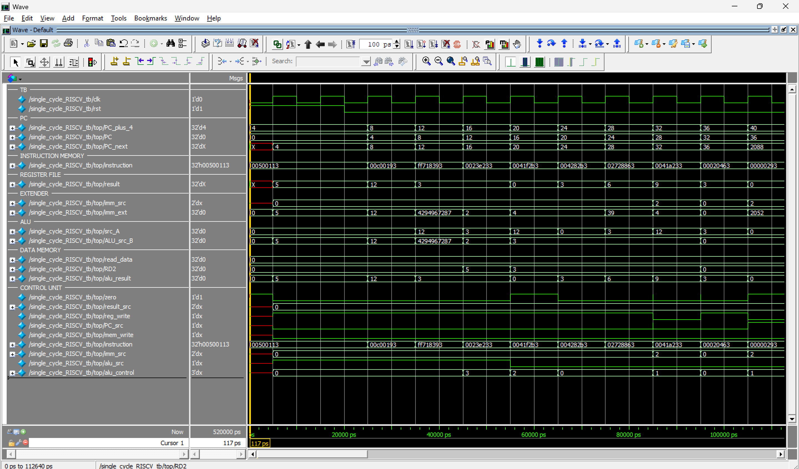

# Implementación de Procesador RISC-V Single-cyle

Fátima lvarez Nuño  
A01645815  
Fecha: 25/05/2025

---

## 🎯 Objetivo del Proyecto

Este proyecto consiste en la implementación de un procesador **RISC-V de arquitectura single-cycle**. En este diseño, cada instrucción se completa en un solo ciclo de reloj, simplificando la lógica de control y el camino de datos. Todo el diseño está desarrollado en **Verilog** y se compone de módulos interconectados que emulan los componentes esenciales de una CPU.

---

## 💻 Descripción de los Módulos

El procesador se organiza en módulos para facilitar la comprensión y el desarrollo de cada uno. A continuación, se detalla la función de cada módulo:

### `single_cycle_RISCV.v`
Es el **módulo principal** que integra y conecta todos los componentes del procesador, el flujo de datos y las señales de control para la ejecución de instrucciones.

### `single_cycle_RISCV_tb.v`
El **testbench** para el módulo `single_cycle_RISCV`. Se encarga de generar la señal de reloj (`clk`), simular el reinicio (`rst`), ejecutar el procesador durante ciclos y muetsra la evolución del **Program Counter (PC)**, la **instrucción actual** y el **contenido de algunos registros clave** para la verificación.

### `alu_decoder.v`
Este módulo decodifica las señales de función de la instrucción (`funct3`, `funct7_5`, `op[5]`) junto con la señal `alu_op` proveniente del `main_decoder` para generar la señal `alu_control`. `alu_control` es la señal de 3 bits que especifica la operación exacta que debe realizar la **ALU** (e.g., `add`, `sub`, `and`, `or`, `slt`).

### `alu.v`
La **Unidad Aritmético-Lógica (ALU)**. Implementa las operaciones aritméticas y lógicas básicas (suma, resta, AND, OR) y la operación de comparación `SLT` (Set Less Than). Además, produce una señal `zero` si el resultado de la operación es cero, esencial para las condicionales.

### `control_unit.v`
La **unidad de control principal**. Integra la lógica del `main_decoder` y el `alu_decoder` para generar todas las señales de control necesarias para el correcto funcionamiento del procesador. Recibe la instrucción y el `zero` de la ALU, y produce señales como `mem_write`, `alu_src`, `reg_write`, `result_src`, `imm_src`, `alu_control`, y `PC_src`.

### `data_memory.v`
Simula una **memoria de datos** de 32 bits. Permite operaciones de lectura y escritura. La escritura está condicionada por la señal `WE` (Write Enable), asegurando que los datos se modifiquen solo cuando sea necesario.

### `extend.v`
Módulo de **extensión de inmediato**. Se encarga de convertir los campos inmediatos (de 12 o 20 bits) extraídos de la instrucción a un valor de 32 bits, realizando la extensión de signo adecuada para instrucciones tipo I, S, B y J.

### `instruction_memory.v`
La **memoria de instrucciones**. Carga el código del programa desde un archivo externo (`instructions.txt`) al inicio de la simulación. Utiliza la dirección proporcionada por el **Program Counter (PC)** para obtener la instrucción correspondiente que será ejecutada.

### `main_decoder.v`
Este módulo genera las **señales de control principales** a partir del campo `op` (opcode) de la instrucción RISC-V. Sus salidas incluyen `branch`, `jump`, `mem_write`, `alu_src`, `reg_write`, `result_src`, `imm_src`, y `alu_op`, dirigiendo el comportamiento general del camino de datos.

---

## 📂 Archivos Adicionales

-   `instructions.txt`: Contiene el código máquina de las instrucciones que serán cargadas y ejecutadas por el procesador. Este archivo es leído por el módulo `instruction_memory`.

---

## 📊 Diagrama del Camino de Datos

El diseño del procesador RISC-V de ciclo único organiza todos los componentes necesarios para ejecutar una instrucción en una única fase del reloj. El camino de datos incluye:

* **PC (Program Counter):** Almacena la dirección de la instrucción actual.
* **Instruction Memory:** Obtiene la instrucción basándose en la dirección del PC.
* **Register File:** Lee los valores de dos registros y permite escribir un resultado en un registro destino.
* **Unidad de Control (Control Unit):** Genera todas las señales de control a partir de la instrucción.
* **Extensor de Inmediato (Extend):** Convierte los valores inmediatos de la instrucción a 32 bits con signo.
* **ALU (Arithmetic Logic Unit):** Realiza operaciones aritméticas y lógicas.
* **Memoria de Datos (Data Memory):** Usada para operaciones de carga (`lw`) y almacenamiento (`sw`).
* **Multiplexores (MUXes):** Selector de datos para diversas rutas en el camino de datos.
* **Adders:** Sumadores para calcular `PC + 4` y la dirección objetivo de bifurcaciones/saltos (`PC + inmediato`).
* **MUX final para el resultado:** Selecciona entre el resultado de la ALU o el dato leído de memoria para escribir en el banco de registros.

### Diagrama ASCII:

                                       +------------------+
                                       | Program Counter  |
                                       |       (PC)       |
                                       +---------+--------+
                                                 |
                                                 v
                                    +-----------------------+
                                    |  Instruction Memory   |
                                    |   (Addr) -> (Instr)   |
                                    +---------+-------------+
                                              |
      .---------------------------------------+----------------------------------.
      |                                       |                                  |
      |          Instruction[31:0]            | Opcode [6:0]                     |
      |                                       | Funct3 [14:12]                   |
      |                                       | Funct7_5 [30]                    |
      |                                       | Op_5 [5]                         |
      |                                       v                                  v
      |                               +------------------+             +------------------+
      |                               |   Control Unit   |             |   Imm. Extender  |
      |                               | (Main & ALU Dec.)|             | (I, S, B, J Type)|
      |                               +--------+---------+             +--------+---------+
      |                                        | imm_src                         | imm_ext
      |  PC_src <------------------------------'---------+                      /
      |  Result_src <--------------------------'---------+                     /
      |  Reg_Write <---------------------------'---------+                    /
      |  ALU_Src   <---------------------------'---------+                   /
      |  Mem_Write <---------------------------'---------+                  /
      |  ALU_Control <-------------------------'---------+                 /
      |                                        |                           /
      |                                        |                          /
      |                                        |                         /
      |                                        |                        /
      |                                        v                       v
      |  Instruction[19:15] (rs1) --> +----------------+          +---------+
      |  Instruction[24:20] (rs2) --> | Register File  |<---------| MUX B   | <-- RD2 (de RegFile)
      |  Instruction[11:7]  (rd) ---> | (RD1, RD2, WD3)|          | ALU_Src |
      |                               +----------------+          +---+-----+
      |                                   |  |                        |
      |                            RD1 (src_A) |                    ALU_src_B
      |                                   |  |                        |
      |                                   v  v                        v
      |                              +----------------+           +------------------+
      |                              | Adder (PC+4)   |           |       ALU        |
      |                              +----------------+           | (ALU_Control)    |
      |                                     |                     +-------+----------+
      |                                     | PC_plus_4                   | alu_result
      |                                     |                             |
      |                                     |                             +---> Zero
      |                                     |                             |
      |                                     v                             v
      |                 PC_target <-----------------------+             +-----------------+
      |                                     |             |             |   Data Memory   |
      |                                     |             |             | (Read/Write)    |
      |           +-----------------+       |             |             +-----+-----------+
      |           | MUX PC_next     |<------+-------------+                   | read_data
      |           | (PC_src)        |                     | mem_write <-------+
      |           +--------+--------+                     |                     |
      |                    |                              |                     v
      |                    v                              |           +-----------------+
      '-------------------> PC_next ----------------------------------+  MUX Resultado  |<-- ALU_result (para R-type, I-type)
                                                            |         | (Result_src)    |
                                                            |         +--------+--------+
                                                            |                  |
                                                            '------------------+
                                                                               |
                                                                               v
                                                          (WD3) <--------------+
                                                          (Write Data back to Register File)

---

## 📈 Evidencia de Simulación

Aquí se muestra una captura de pantalla de la simulación Verilog, evidenciando el funcionamiento del procesador.

---

## 📝 Conclusión

La implementación de este procesador RISC-V de ciclo único es fundamental para comprender las bases de la arquitectura de computadoras. A través de la modularización y la interconexión de componentes clave (unidad de control, ALU, memorias, registros, multiplexores), se logra un flujo de datos secuencial y predecible en cada ciclo de reloj.

Aunque el diseño single-cycle no es el más óptimo en términos de rendimiento para aplicaciones reales, su simplicidad permite una visión clara y completa del ciclo de ejecución de una instrucción. Las simulaciones realizadas confirman que el camino de datos y la lógica de control operan correctamente, consolidando los conceptos de diseño digital. Esta implementación sirve como una base sólida para explorar arquitecturas más avanzadas, como los procesadores multi-cycle o pipelined.